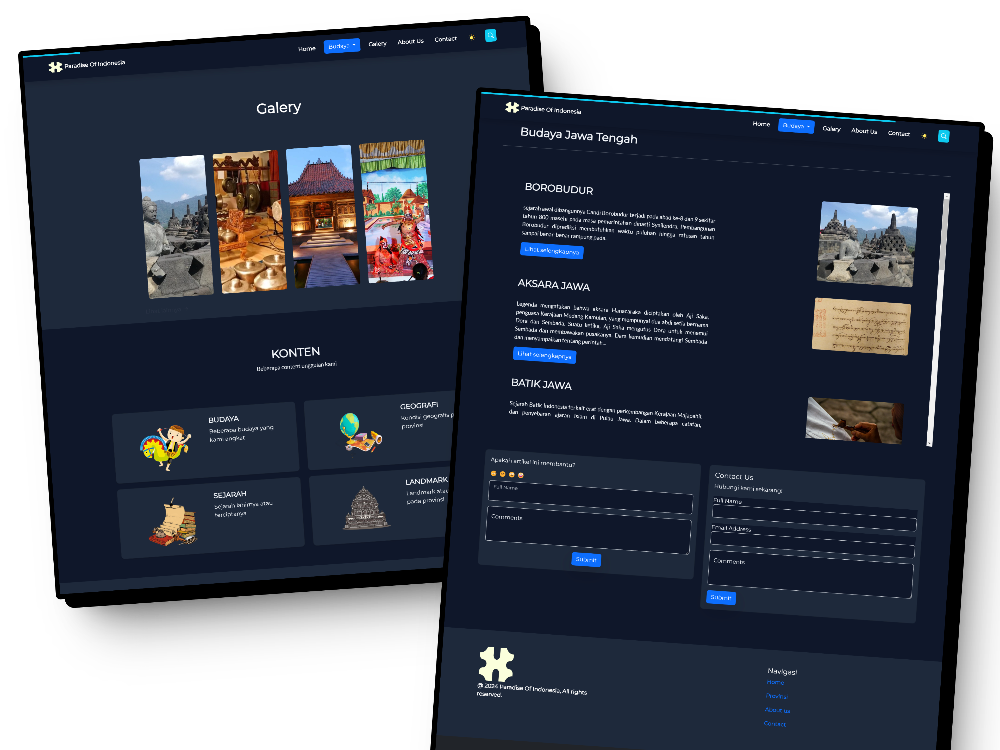

  

 
# PARADISE OF INDONESIA
Capstone Project SIB Cycle 6 - Dicoding 2024

## Tech

### Team ID : `C624-PS154`

| Tema : `Sosial, Budaya, Pariwisata dan Lingkungan yang berkelanjutan` | Judul Project : `Paradise Of Indonesia` |
| ------------------------ | --------------------------------------- |

### Capstone Team

| ID          | NAMA                                                              |
| ----------- | ------------------------------------------------------------------|
| F1186YB061  | [Aldiva Fadlie Fauzan](https://github.com/aldivafzn)              |
| F1206YB369  | [Wifqi Wifakul Azmi](https://github.com/wifqiazmi)                |
| F7156YB314  | [Muhammad Dika Bima Satria](https://github.com/ChottaaBheem)      |

  ## :mag_right: Website Preview

## Executive Summary

Latar Belakang proyek kami mencakup analisis tentang potensi pariwisata Indonesia, tantangan yang dihadapi dalam mempromosikan budaya indonesia di dunia digital, dan penggunaan teknologi untuk meningkatkan media budaya yang menceritakan tentang beberapa budaya yang ada di Indonesia. Tim kami memilih proyek ini karena kami percaya bahwa Indonesia memiliki potensi yang luar biasa untuk menarik wisatawan global, namun potensi tersebut belum sepenuhnya dimanfaatkan secara efektif.

## Project Scope & Deliverables:

Tujuan utama proyek "Paradise of Indonesia" adalah meningkatkan eksposur global terhadap  budaya Indonesia melalui penggunaan teknologi digital. Dengan membangun situs web yang menarik dan informatif, kami berharap dapat menarik perhatian wisatawan dari berbagai negara dan menginspirasi mereka untuk menjelajahi keindahan Indonesia.

## 🚧 Status Proyek

Proyek ini sedang dalam tahap pengembanan. Kami berupaya terus memperbarui dan meningkatkan fitur-fitur yang ada.

## Presented By :

|  |  |  |
| ------------------------------------------------------------------------------------------------------------- | ------------------------------------------------------------------------------------------ | ------------------------------------------------------------------------------------------------ |

  

